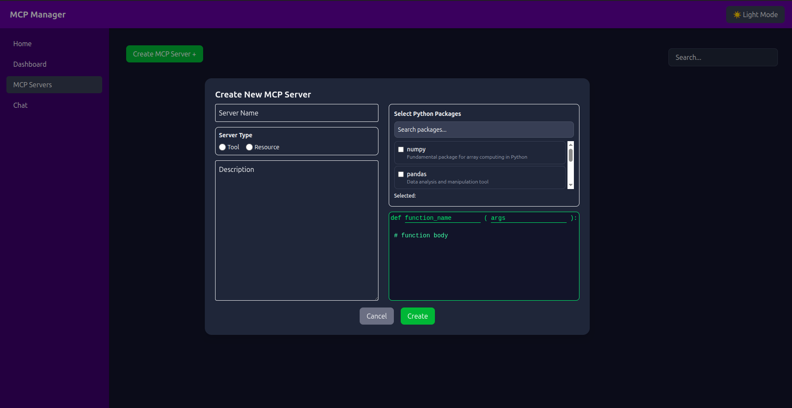
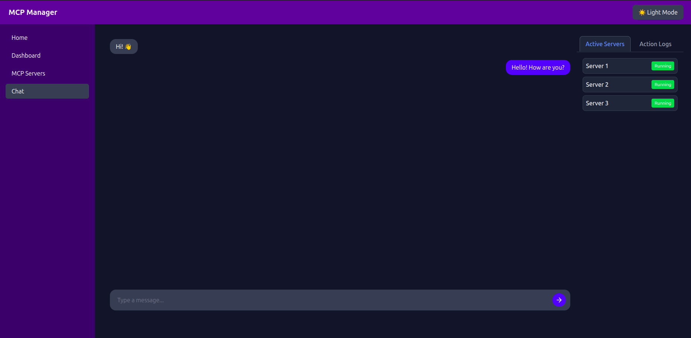

# MCP Server Manager (Work in Progress)

MCP Server Manager is an all-in-one tool to create, pause, play, and delete MCP servers, with a built-in chat interface for interacting with local LLMs. Complete pipeline from server management to AI conversations, ready for Docker deployment.

 

## 🎥 Screenshots

 

## 🚀 Features

 

## 🏗 Architecture

 

## 🛠 Tech Stack